# School Payments & Dashboard Frontend

A responsive, modern frontend for the School Payments & Dashboard application, built with React.js and Material UI.

## 🔧 Tech Stack

- **React.js** - Frontend library (Create React App)
- **Material UI** - Component library and styling
- **Axios** - HTTP client for API requests
- **React Router** - Client-side routing
- **Custom Hooks** - Including useDebounce for search optimization

## 📋 Features

- **Comprehensive Dashboard** - View and manage all transactions in a searchable, paginated table
- **School-specific Transaction Views** - Filter transactions by school ID
- **Transaction Status Checker** - Check status of specific transactions by custom order ID
- **Manual Transaction Update** - Update transaction status manually
- **Responsive Design** - Works on all device sizes
- **Search with Debouncing** - Optimized search functionality
- **Dynamic Filtering** - Filter by status and date range
- **Loading States** - Visual indicators during API calls
- **Error Handling** - Clear error messages for failed API calls
- **Clean UI** - Modern interface with hover effects and visual feedback

## 📁 Project Structure

```
school-pay-frontend/
├── node_modules/        # Dependencies
├── public/              # Static files
├── screenshots/         # Application screenshots for documentation
│   ├── dashBoardResponsiveOne.png
│   ├── dashBoardResponsiveTwo.png
│   ├── dashBoardResponsiveThree.png
│   ├── menuResponsive.png
│   ├── SpecificSchoolTransResponsiveOne.png
│   ├── SpecificSchoolTransResponsiveTwo.png
│   ├── SpecificSchoolTransResponsiveThree.png
│   ├── TransStatusCheckResponsiveOne.png
│   ├── TransStatusCheckResponsiveTwo.png
│   ├── TransStatusUpdateResponsiveOne.png
│   ├── TransStatusUpdateResponsiveTwo.png
│   └── TransStatusUpdateResponsiveThree.png
├── src/
│   ├── api/             # API integration
│   │   └── transactions.js
│   ├── components/      # Reusable components
│   │   ├── dashboard/   # Dashboard components
│   │   │   ├── index.js
│   │   │   ├── TransactionFilters.jsx
│   │   │   └── TransactionTable.jsx
│   │   ├── manual_update/
│   │   │   └── ManualUpdateForm.jsx
│   │   ├── navbar/
│   │   │   └── Navbar.jsx
│   │   ├── school_transactions/
│   │   │   ├── index.js
│   │   │   ├── SchoolSelector.jsx
│   │   │   └── SchoolTransactionsTable.jsx
│   │   └── transaction_status/
│   │       ├── StatusCheckerForm.jsx
│   │       └── StatusDisplay.jsx
│   ├── contexts/        # React contexts
│   │   └── ThemeContext.jsx
│   ├── hooks/           # Custom React hooks
│   │   └── useDebounce.js
│   ├── pages/           # Application pages
│   │   ├── DashboardPage.jsx
│   │   ├── ManualUpdatePage.jsx
│   │   ├── SchoolTransactionsPage.jsx
│   │   └── TransactionStatusPage.jsx
│   ├── styles/          # Styling
│   │   ├── common.js
│   │   └── Theme.js
│   ├── utils/           # Utility functions
│   │   └── FunctionsUtils.js
│   ├── App.css
│   ├── App.js           # Main App component
│   ├── App.test.js      # Tests for App component
│   ├── index.css        # Global styles
│   ├── index.js         # Application entry point
│   ├── logo.svg         # Logo asset
│   ├── reportWebVitals.js
│   └── setupTests.js
├── .gitignore
├── package-lock.json
├── package.json
└── README.md
```

## 🚀 Getting Started

### Prerequisites

- Node.js (v14.0.0 or later)
- npm (v6.0.0 or later)

### Installation

1. Clone the repository

   ```bash
   git clone https://github.com/yourusername/school-pay-frontend.git
   cd school-pay-frontend
   ```

2. Install dependencies

   ```bash
   npm install
   ```

3. Create a `.env` file in the root directory:

   ```
   ```

4. Start the development server
   ```bash
   npm start
   ```

The application will be available at `http://localhost:3000`


REACT_APP_LIVE_URL=https://schoolpayfrontendassignment.vercel.app/


## 📱 Pages and Components

### 1. Dashboard Page

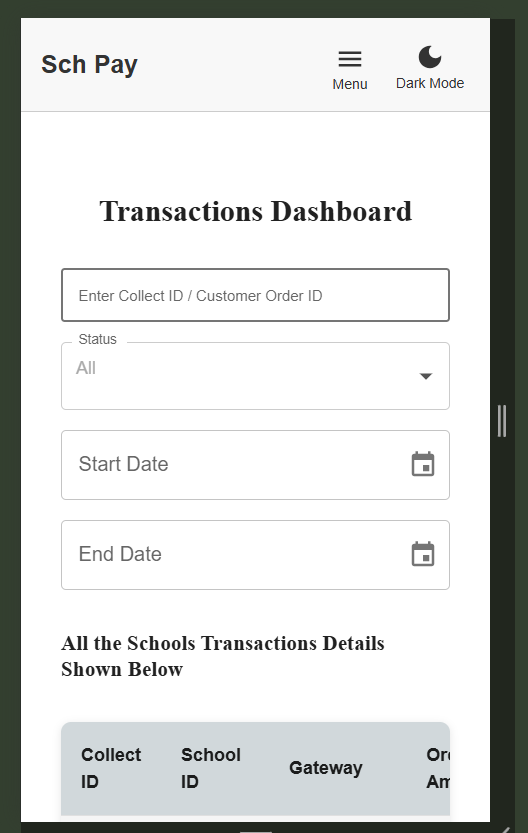
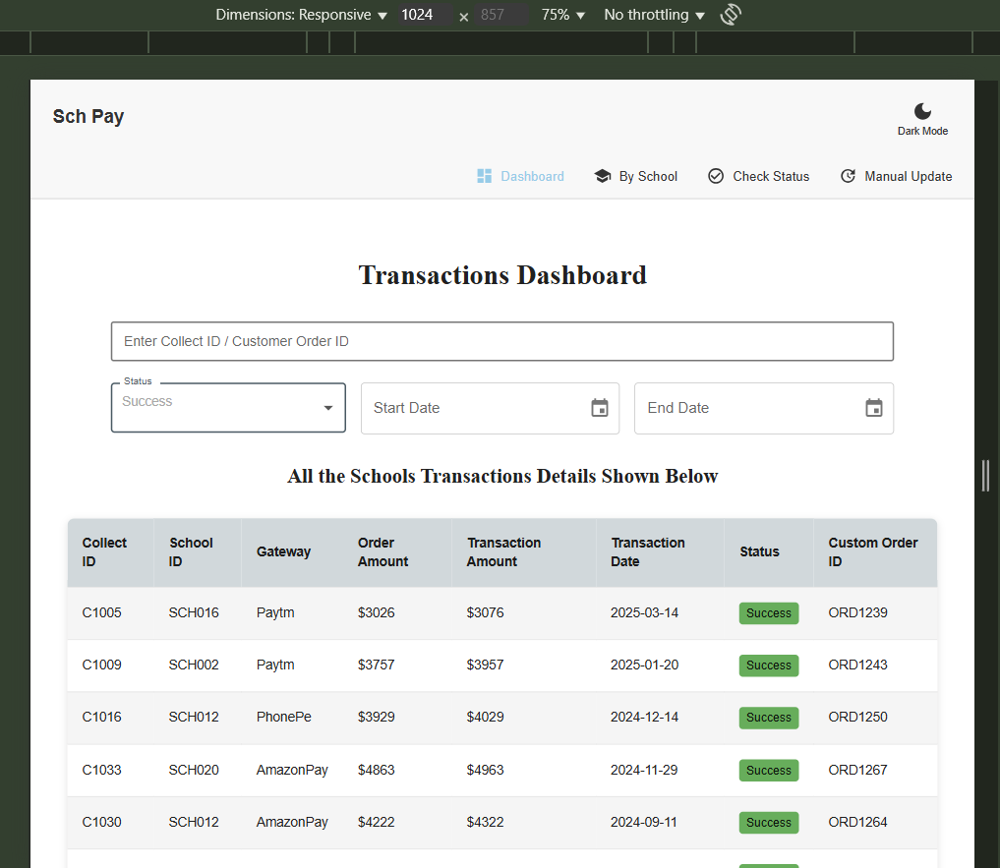
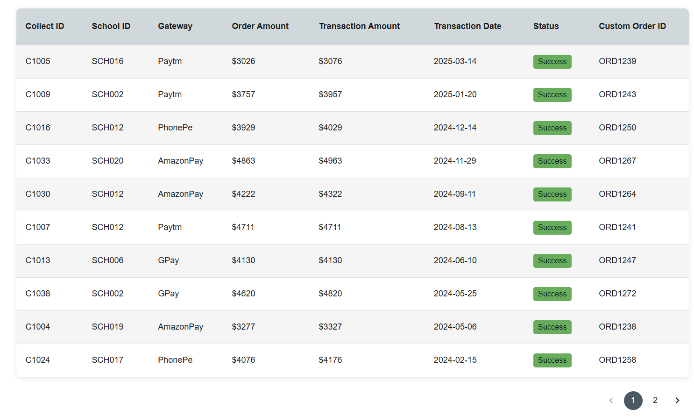

The main dashboard displays all transactions in a searchable, paginated table with:

- Transaction details (collect_id, school_id, gateway, amounts, status)
- Status filtering (Success, Pending, Failed)
- Date range filtering
- Search functionality with debounce
- Clean UI with hover effects

**Key Components:**

- `TransactionTable.jsx` - Displays transaction data with pagination
- `TransactionFilters.jsx` - Provides filtering options

### 2. School Transactions Page

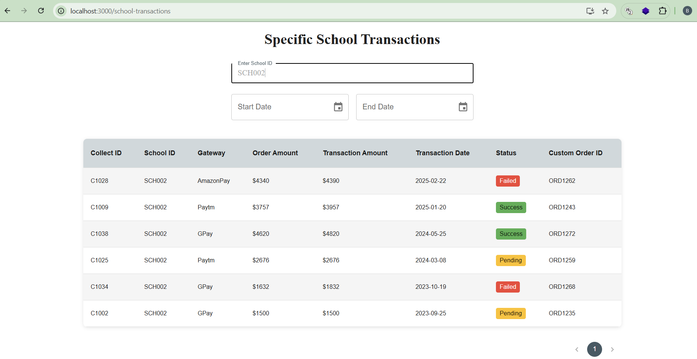
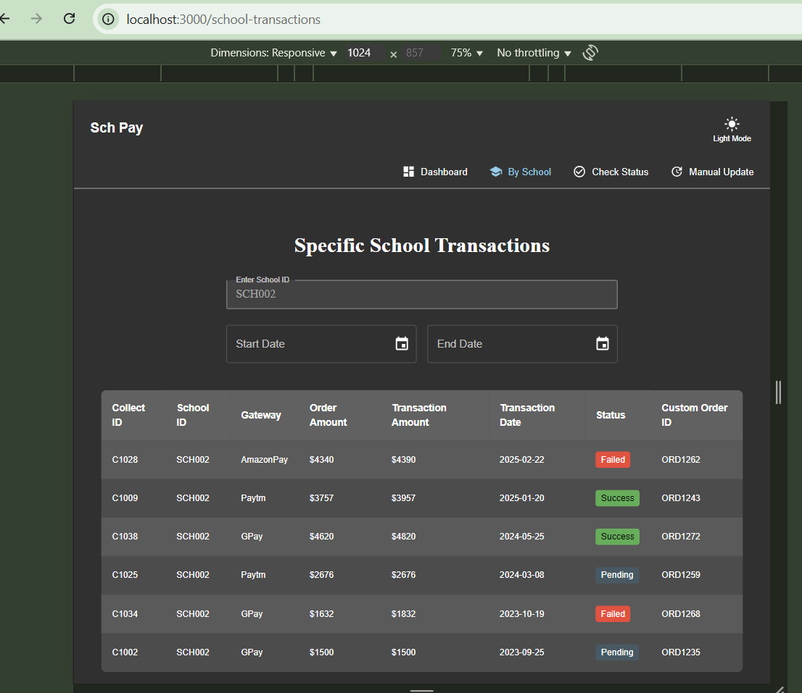
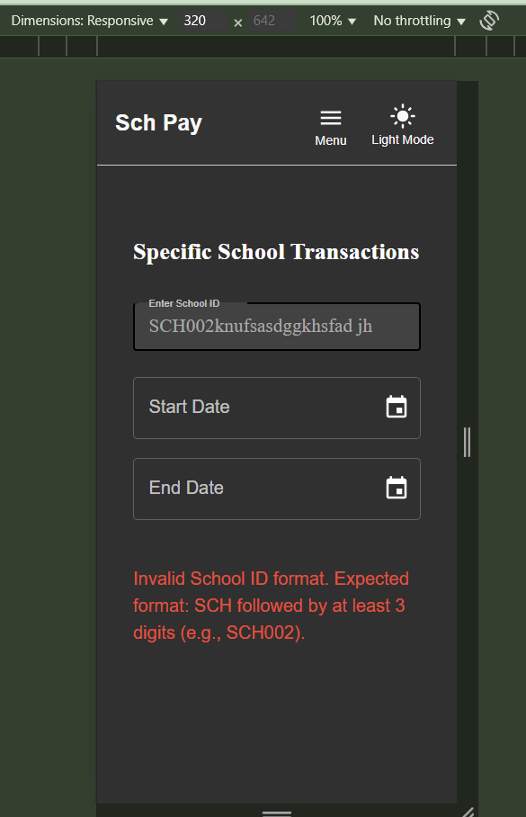

View transactions for a specific school:

- School selector dropdown
- Filtered transaction table
- Date range filtering

**Key Components:**

- `SchoolSelector.jsx` - Dropdown to select specific school
- `SchoolTransactionsTable.jsx` - Displays school-specific transactions

### 3. Transaction Status Page

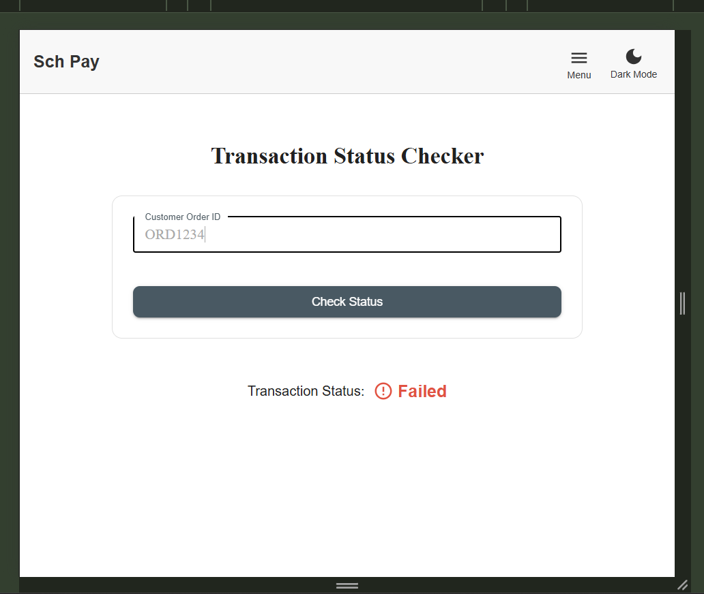
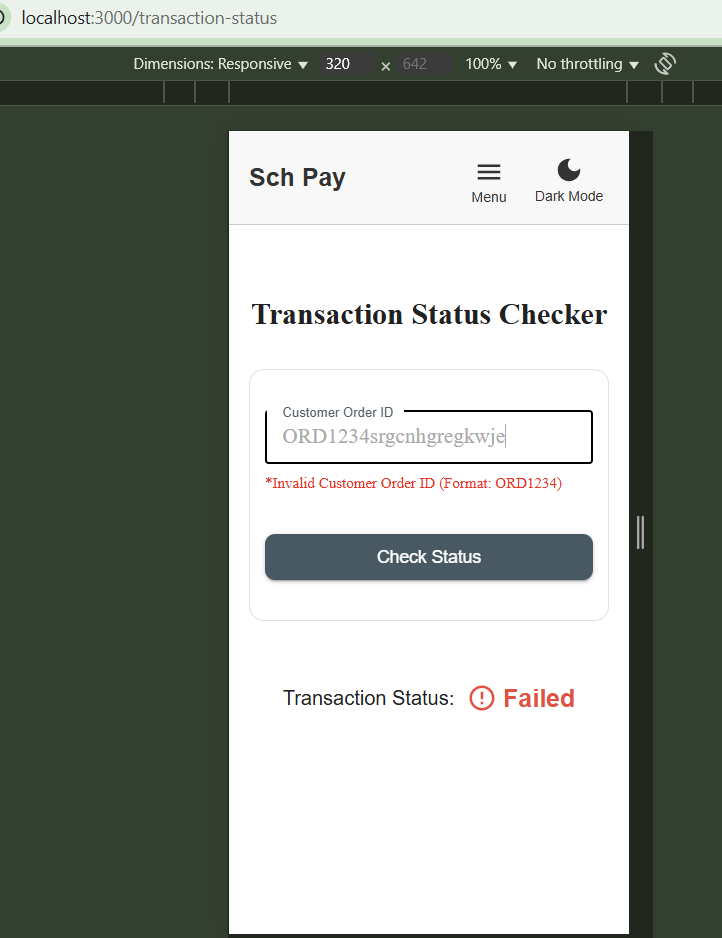

Check the status of a specific transaction:

- Input field for custom_order_id
- Status display with visual indicators

**Key Components:**

- `StatusCheckerForm.jsx` - Form to input custom_order_id
- `StatusDisplay.jsx` - Displays transaction status with visual indicators

### 4. Manual Update Page

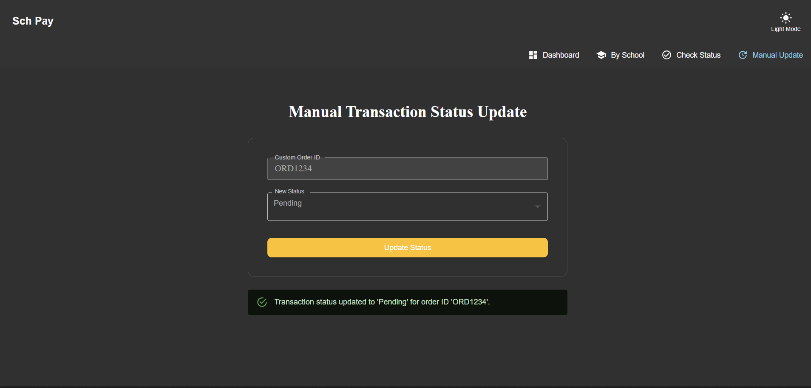
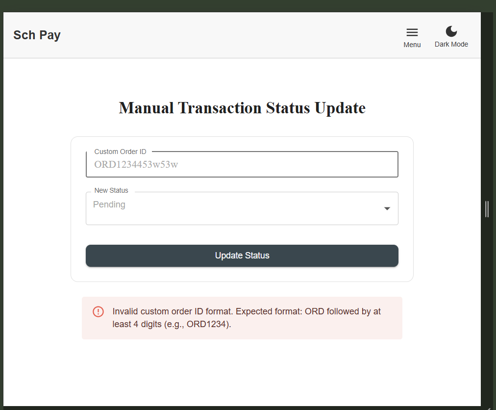
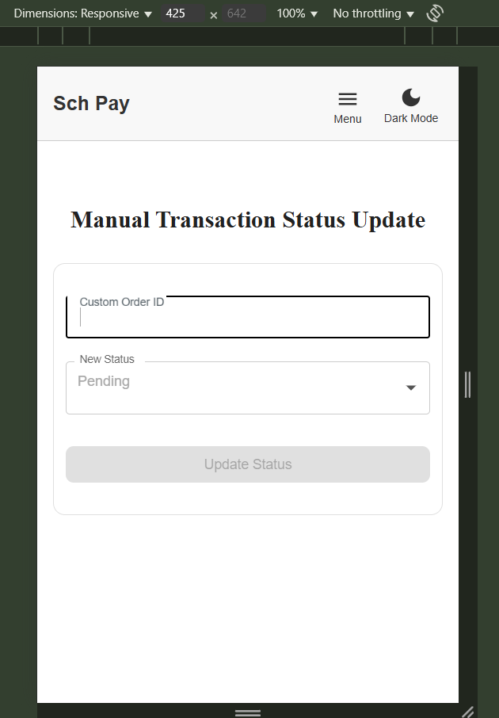

Manually update transaction status:

- Input for custom_order_id
- Status selector
- Success/error handling

**Key Components:**

- `ManualUpdateForm.jsx` - Form to update transaction status

## 🔌 API Integration

The application communicates with the backend through the API module located in `src/api/transactions.js`.

### API Endpoints Used:

- `GET /api/transactions` - Fetch all transactions with pagination and filters
- `GET /api/transactions/school/:school_id` - Fetch transactions for a specific school
- `GET /api/transactions/check-status/:custom_order_id` - Check transaction status
- `POST /api/transactions/manual-update` - Update transaction status manually

### Implementation Details:

- Axios is used for all API requests
- Loading states are managed during API calls
- Success and error cases are handled appropriately
- Input validation is implemented before API calls

## 🔍 Search with Debouncing

The application implements a custom hook `useDebounce` in `src/hooks/useDebounce.js` to optimize search functionality:

- Reduces unnecessary API calls during typing
- Improves performance for search operations
- Configurable delay (default: 500ms)

## 🎨 UI/UX Features

- **Material UI Components**: Utilized and customized MUI components for a consistent design language
- **Responsive Design**: Works seamlessly on desktop, tablet, and mobile devices as shown in the screenshots
- **Loading States**: Visual indicators during API calls
- **Error Handling**: User-friendly error messages
- **Form Validation**: Input validation before form submission
- **Visual Feedback**: Hover effects and status indicators
- **Clean Layout**: Intuitive navigation and data presentation
- **Responsive Navigation**: Menu adapts to different screen sizes (see [Menu Screenshot](./src/screenshots/menuResponsive.png))

## 🔄 Theme Support

The application includes a basic theme management using `ThemeContext.jsx` in the contexts directory, which allows for future expansion of theming capabilities.

## 📊 Testing

Run tests with:

```bash
npm test
```

The application includes basic component tests using React Testing Library.

## 🚀 Deployment

The frontend is deployed at: [https://schoolpayfrontendassignment.vercel.app/](https://schoolpayfrontendassignment.vercel.app/)

### Deployment Process:

1. Build the production-ready application:

   ```bash
   npm run build
   ```

2. Deploy to your hosting provider of choice (Netlify, Vercel, AWS Amplify, etc.)

## 🧪 Future Enhancements

- Real-time transaction updates using WebSockets - not added on the frontend side
- Dark/light mode toggle - added

## 📝 License

This project is licensed under the MIT License - see the LICENSE file for details.

## 👥 Contributors

- Kantamaneni Bharath Sai - [GitHub Profile](https://github.com/kantamanenibharathsai?tab=repositories)
